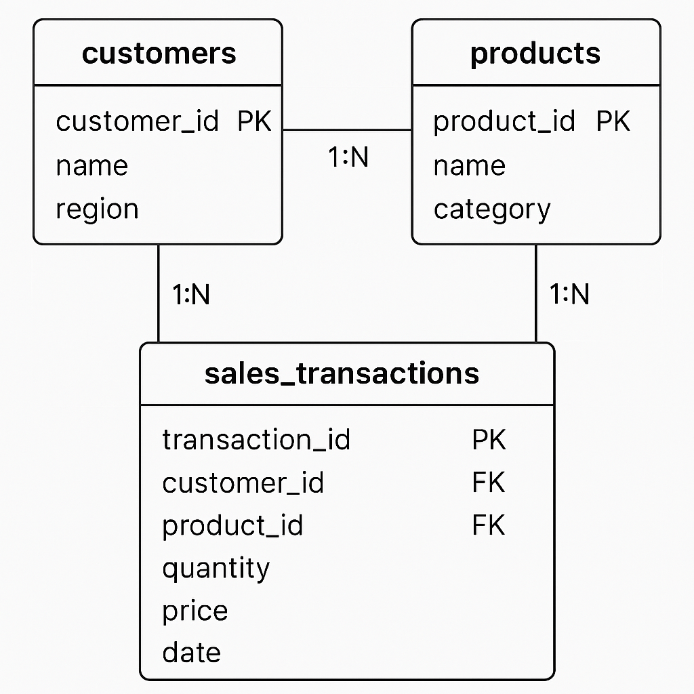

 # SQL JOINs & Window Functions Project

**Course:** Database Development with PL/SQL (INSY 8311)  
**Instructor:** Eric Maniraguha | eric.maniraguha@auca.ac.rw  
**Student Name:** GANZA Jules  
**Student ID:** 25110  
**Assignment Type:** Individual Assignment I  
**Tool Used:** MySQL Workbench  

---

## Table of Contents
1. [Business Scenario](#business-scenario)  
2. [Database Schema & ER Diagram](#database-schema--er-diagram)  
3. [SQL JOIN Queries](#sql-join-queries)  
4. [Window Function Queries](#window-function-queries)  
5. [Results Analysis](#results-analysis)  
6. [References](#references)  
7. [Integrity Statement](#integrity-statement)  

---

## Business Scenario

**Business Context:**  
A small online retail store selling everyday household items such as kitchen tools, cleaning supplies, and small electronics. The Sales and Marketing department wants to understand customer purchasing behavior and product performance.

**Data Challenge:**  
The company has large amounts of transaction data that are not organized for trend analysis. It is difficult to identify top-selling products, active or inactive customers, and monthly sales trends.

**Expected Insights:**  
- Identify products generating the most revenue  
- Determine most and least active customers  
- Track month-to-month sales changes  
- Segment customers based on spending  
- Detect patterns to improve marketing and inventory planning  

---

## Database Schema & ER Diagram

The database consists of three related tables:

| Table Name          | Description                                         |
|--------------------|-----------------------------------------------------|
| customers          | Customer details and demographics                  |
| products           | Product catalog, prices, and categories           |
| sales_transactions | Customer transactions linking customers & products|

**ER Diagram:**  
  

*The ERD models a sales system linking customers, products, and transactions.*

---

## SQL JOIN Queries

### 1. INNER JOIN – Transactions with Valid Customers and Products

```sql
SELECT 
    st.transaction_id,
    c.customer_name,
    p.product_name,
    st.quantity,
    st.price
FROM sales_transactions st
INNER JOIN customers c ON st.customer_id = c.customer_id
INNER JOIN products p ON st.product_id = p.product_id;
Interpretation:
Returns only valid transactions linking real customers to real products. Helps verify clean data and understand normal transaction activity.

2. LEFT JOIN – Customers with No Transactions
SELECT 
    c.customer_name,
    st.transaction_id
FROM customers c
LEFT JOIN sales_transactions st 
    ON c.customer_id = st.customer_id;


Interpretation:
Identifies inactive customers. Useful for targeting promotions or follow-up campaigns.

3. FULL OUTER JOIN Simulation – Products With or Without Sales
SELECT 
    p.product_name,
    st.transaction_id
FROM products p
LEFT JOIN sales_transactions st ON p.product_id = st.product_id
UNION
SELECT 
    p.product_name,
    st.transaction_id
FROM products p
RIGHT JOIN sales_transactions st ON p.product_id = st.product_id;


Interpretation:
Includes all products (sold or not) and all transactions. Helps detect missing or incorrect product links.

4. SELF JOIN – Customers in the Same Region
SELECT 
    c1.customer_name AS customerA,
    c2.customer_name AS customerB,
    c1.region
FROM customers c1
JOIN customers c2 
    ON c1.region = c2.region 
    AND c1.customer_id <> c2.customer_id;


Interpretation:
Identifies customers in the same region. Useful for regional marketing or grouping customers by location.

Window Function Queries
1. Ranking Functions – Top Selling Products
SELECT 
    p.product_name,
    SUM(st.quantity * st.price) AS total_sales,
    RANK() OVER (ORDER BY SUM(st.quantity * st.price) DESC) AS ranking
FROM sales_transactions st
JOIN products p ON st.product_id = p.product_id
GROUP BY p.product_id;


Interpretation:
Ranks products by revenue to identify best-performing items.

2. Aggregate Window Functions – Running Sales Totals
SELECT
    transaction_date,
    quantity * price AS sales_amount,
    SUM(quantity * price) OVER (ORDER BY transaction_date) AS running_total
FROM sales_transactions;


Interpretation:
Shows cumulative revenue over time to identify growth patterns.

3. Navigation Functions – Month-to-Month Comparison
WITH monthly_sales AS (
    SELECT
        DATE_FORMAT(transaction_date, '%Y-%m-01') AS month,
        SUM(quantity * price) AS monthly_total
    FROM sales_transactions
    GROUP BY DATE_FORMAT(transaction_date, '%Y-%m-01')
)
SELECT
    month,
    monthly_total,
    LAG(monthly_total) OVER (ORDER BY month) AS previous_month,
    monthly_total - LAG(monthly_total) OVER (ORDER BY month) AS difference
FROM monthly_sales
ORDER BY month;


Interpretation:
Compares each month to the previous one to detect seasonal trends or sudden changes in sales.

4. Distribution Functions – Customer Segmentation
SELECT 
    customer_id,
    SUM(quantity * price) AS total_spent,
    NTILE(4) OVER (ORDER BY SUM(quantity * price)) AS spending_quartile
FROM sales_transactions
GROUP BY customer_id;


Interpretation:
Segments customers into quartiles based on spending. Useful for targeted marketing and loyalty programs.

Results Analysis

Descriptive:
Monthly sales totals, customer spending levels, and product performance were revealed. JOINs identified active/inactive customers and top-selling products.

Diagnostic:
Monthly variations may result from seasonal demand, promotions, or product popularity. High-performing products satisfy customer needs; low performers may need attention.

Prescriptive:
Focus marketing on inactive customers, promote high-ranking products, adjust stock or pricing for low-sales items, and monitor monthly trends for planning.


References

MySQL Documentation – Window Functions: https://dev.mysql.com/doc/refman/8.0/en/window-functions.html

MySQL Documentation – JOIN Syntax: https://dev.mysql.com/doc/refman/8.0/en/join.html

W3Schools SQL Tutorial: https://www.w3schools.com/sql/

PostgreSQL Documentation – Date/Time Functions: https://www.postgresql.org/docs/current/functions-datetime.html

Oracle Academy Learning Resources: https://academy.oracle.com


Integrity Statement


All queries were executed personally in MySQL Workbench, and screenshots represent my own work. Implementations and analysis represent original work. No AI-generated content was copied without attribution or adaptation.
